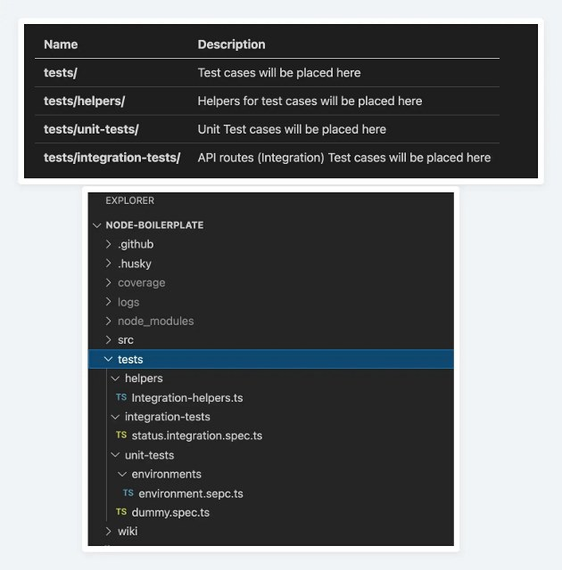

# Node js Test environment setup

### Testing Guidelines
- Test cases should cover all paths of the code. 
- Use Faker instance 
Testing Framework
- **jest**
- **sequelize-mock**
- **supertest**
- **superagent**
### Packages to be installed

1. **Setup and Installation**

   1. Prefer to use pnpm rathen than npm. 
   2. **```npm uninstall -D jest```**(it removes the jest from package.json older version)
   3. **```npm install -D babel-cli babel-preset-env jest-cli faker supertest ts-jest superagent @types/jest```**
   4. **```npm install -D jest (after installation Make sure it is v29)```**
  
2. Now you need to checkout to features/unit-testing branch.
      ```js
      git checkout feature/unit-testing
      ```
3. In each of the service we need to do the following. 
   1. Create a seperate server.js file.
   2. In the server.js move the app initiation. Eg
   ```js
      const app = require("./profileservice"); 
      const { pubInit} = require('./src/utils/pubSub') 
      const PORT = process.env.PORT || 30004 
      const server = app.listen(PORT, async () => { 
      await pubInit() 
      logService.info(`Server is running on port ${PORT}`, {}, 'server', __filename) 
      }) 
      process.on('unhandledRejection', (err) => { 
        logService.error(`${err.message} ${err.stack}`) 
        logService.error('UNHANDLED REJECTION! 💥 Shutting down...', { err }, 'server', __filename) 
        server.close(() => { 
        pubCloseConn() 
        process.exit(1) 

      }) 
    })

4. Remove the equivalent code in profileservice.js. and export app from profile service. **```module.exports = app```**
  
5. Create tests folder with the following directory structure
  
 
6. Create jest.config.js file in your root and add the following:
      ```js
      module.exports = { 

      preset: 'ts-jest', 

      testEnvironment: 'node', 

      setupFiles: ['dotenv/config'] 

      } 
      ```
7. *Go-to package.json file and change/add inside the Script*
    ```js
      "start": "nodemon server.js",
      "test": "node --experimental-vm-modules node_modules/jest/bin/jest.js --config ./jest.config.js --forceExit --coverage --logHeapUsage",
      "testlastcommit": "jest --config ./jest.config.js --forceExit --coverage --lastCommit --logHeapUsage" 
      ```

  
8. Create a helper.ts file in the tests root directory with the following code
      ```js
        import * as app from  './profileservice'
        import * as express from 'express';
        import * as faker from 'faker'
        import supertest from 'supertest'
        import db from './src/utils/dbModels'
        export class TestHelper {
          private static appInstance: express.Application
          private authToken: string
          private thisDb: any
          private faker: faker
          private db: any
          constructor (token) {
            this.appInstance = app
            this.authToken = token
            this.db = db
            this.faker = faker
          }
          public clearDatabase(): void {
            // TODO: 
          }
          public getFaker (): void {
            return this.faker
          }
          public initialize (): void {
            await db.sequelize.sync({ alter: true })
          }
        }
      ``` 
9. Import helper and create helper instance and use it in beforeAll and afterAll appropriately. 
  
10. After the installation of testing setup, when you start writing test cases then you need to make sure  that you will not use {force: true} inside beforeall tag. because it's erase all database that we don't want. and use local db(server).

    ```js
      beforeAll(async () => {
        await thisDb.sequelize.sync();
      });

      afterAll(async () => {
        await thisDb.sequelize.close();
      });
      ```
    
11. For Saple test cases Refer this Testing RepoLink:-
    **https://github.com/akshaykanherkarzype/Unit-Testing_Node-Jest-Sequelize-Supertest**
